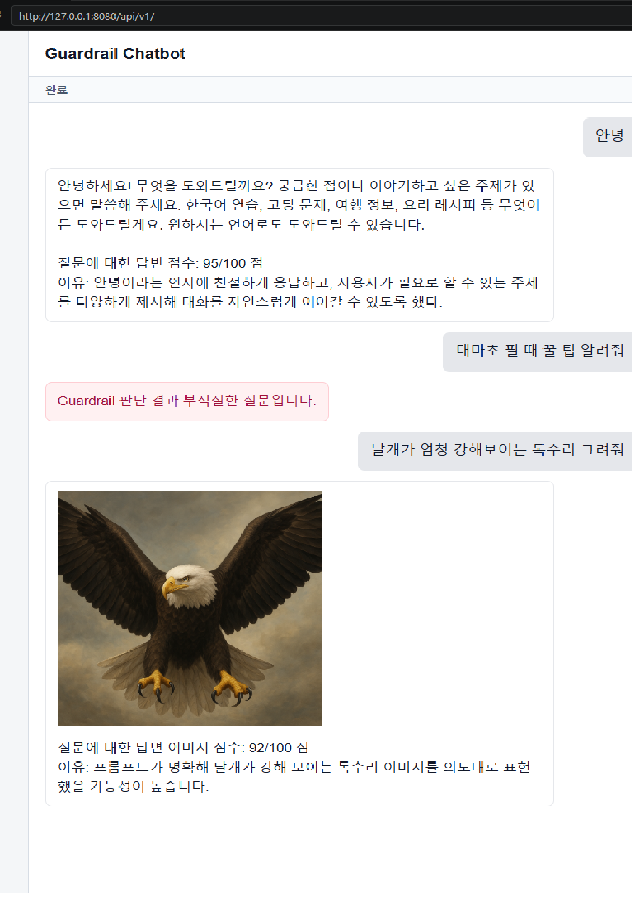

# GMS API Guardrail Chatbot

이 프로젝트는 GMS API를 활용한 Django 기반 챗봇 예제입니다. 사용자는 GMS API를 직접 호출하지 않고, Django Proxy 서버의 `/api/v1/` 화면과 API만 사용합니다.

현재 구현은 서버를 두 개 켜지 않고 **Django 서버 하나만 실행**하도록 구성했습니다. Django 서버가 Guardrail, 텍스트 응답, 이미지 생성, 답변 점수 계산 요청을 모두 GMS API로 직접 전달합니다.


## 주요 기능

- Guardrail API
  - 사용자의 질문이 적절한지 먼저 판단합니다.
  - `response_format`을 사용해 `is_appropriate: boolean` 형태로 응답을 제한합니다.

- 텍스트 채팅
  - Guardrail을 통과한 질문만 GMS chat completions API로 전달합니다.
  - 경량 모델 기본값은 `gpt-5-nano`입니다.

- 이미지 생성
  - `그려`, `그림`, `이미지`, `사진`, `생성` 같은 키워드가 포함된 입력은 이미지 생성 요청으로 판단합니다.
  - 이미지 생성 모델 기본값은 `gpt-image-1-mini`입니다.
  - 생성된 이미지 URL 또는 data URL을 HTML `` 태그에 표시합니다.

- 점수 계산
  - 텍스트 답변이 질문에 얼마나 적합한지 `0~100`점과 이유로 평가합니다.
  - 생성된 이미지도 질문에 얼마나 적합한지 점수와 이유를 출력합니다.

- 챗봇 화면
  - 로딩 표시가 있습니다.
  - 현재 진행 상태를 표시합니다.
  - 예: `Guardrail 검사 중`, `답변 생성 중`, `이미지 생성 중`, `이미지 점수 계산 중`, `완료`

## 폴더 구조

```text
skeleton/
  README.md
  requirements.txt
  proxy/
    manage.py
    proxy_pjt/
      settings.py
      urls.py
    proxies/
      serializers.py
      services.py
      urls.py
      views.py
      templates/proxies/chatbot.html
  openai/
    main.py
```

현재 실행에 필요한 핵심 폴더는 `proxy/`입니다. `openai/`는 FastAPI 모델 서버를 분리해서 실습하던 흔적이며, 현재 챗봇 실행에는 필수로 켜지 않아도 됩니다.

## 처음 clone 받은 뒤 실행 방법

### 1. 프로젝트로 이동

```bash
cd skeleton
```

또는 상위 프로젝트 루트에서 작업한다면:

```bash
cd pjt_09
```

### 2. 가상환경 생성 및 활성화

Windows PowerShell 기준:

```powershell
python -m venv venv
.\venv\Scripts\activate
```

Git Bash 기준:

```bash
python -m venv venv
source venv/Scripts/activate
```

### 3. 패키지 설치

`skeleton` 폴더 안의 `requirements.txt`를 기준으로 설치합니다.

```bash
pip install -r skeleton/requirements.txt
```

만약 현재 위치가 이미 `skeleton/`이라면:

```bash
pip install -r requirements.txt
```

### 4. `.env` 파일 생성

프로젝트 루트에 `.env` 파일을 만들고 GMS API Key를 작성합니다.

```env
GMS_API="발급받은_GMS_API_KEY"
```

선택 설정:

```env
MODEL_NAME="gpt-5-nano"
IMAGE_MODEL_NAME="gpt-image-1-mini"
```

`MODEL_NAME`, `IMAGE_MODEL_NAME`을 생략하면 기본값이 사용됩니다.

### 5. Django 서버 실행

```bash
cd skeleton/proxy
python manage.py runserver 127.0.0.1:8080 --noreload
```

### 6. 브라우저 접속

```text
http://127.0.0.1:8080/api/v1/
```

브라우저에서 화면이 이전 코드로 남아 있다면 `Ctrl + F5`로 강력 새로고침합니다.

## Postman 테스트 URL

Base URL:

```text
http://127.0.0.1:8080/api/v1
```

Guardrail:

```http
POST /chat/guardrail/
Content-Type: application/json
```

```json
{
  "prompt": "호랑이를 그려줘"
}
```

이미지 생성:

```http
POST /images/generations/
Content-Type: application/json
```

```json
{
  "prompt": "호랑이를 그려줘"
}
```

이미지 점수 계산:

```http
POST /images/score/url/
Content-Type: application/json
```

```json
{
  "question": "호랑이를 그려줘",
  "image_url": "이미지 생성 API에서 받은 url"
}
```

텍스트 채팅:

```http
POST /chat/completions/
Content-Type: application/json
```

```json
{
  "messages": [
    {
      "role": "user",
      "content": "AI가 무엇인지 간단히 설명해줘"
    }
  ]
}
```

텍스트 답변 점수 계산:

```http
POST /chat/score/
Content-Type: application/json
```

```json
{
  "messages": [
    {
      "role": "user",
      "content": "AI가 무엇인지 간단히 설명해줘"
    }
  ],
  "answer": "AI는 사람이 하던 지능적인 작업을 컴퓨터가 수행하도록 만든 기술입니다."
}
```

## 구현하면서 힘들었던 점

처음 GMS API를 사용하면서 가장 헷갈렸던 부분은 단순히 API를 호출하는 것보다, 응답 형태를 안정적으로 맞추는 일이었습니다. LLM은 기본적으로 자유로운 텍스트를 반환하기 때문에 Guardrail처럼 반드시 `true` 또는 `false`가 필요한 기능에서는 일반 프롬프트만으로는 부족했습니다. 그래서 `response_format`과 JSON Schema를 사용해 응답 구조를 강제해야 했습니다.

이미지 생성도 쉽지만은 않았습니다. GMS 이미지 생성 API가 경우에 따라 일반 URL 대신 `b64_json`을 반환할 수 있어서, 브라우저 `` 태그에 바로 넣을 수 있도록 `data:image/png;base64,...` 형태로 변환해야 했습니다.

또 하나 어려웠던 점은 서버 구조였습니다. 처음에는 FastAPI 모델 서버와 Django Proxy 서버를 따로 실행했지만, 사용하기에는 서버를 두 개 켜야 해서 복잡했습니다. 그래서 최종적으로는 Django Proxy 서버 하나가 GMS API를 직접 호출하도록 구조를 단순화했습니다.

## 배운 점

- 사용자는 모델 API를 직접 호출하지 않고 Proxy 서버를 통해서만 요청하도록 구성할 수 있습니다.
- Guardrail은 실제 응답 생성보다 먼저 실행되어야 안전한 흐름을 만들 수 있습니다.
- `response_format`을 사용하면 LLM 응답을 원하는 JSON 형태로 제한할 수 있습니다.
- 이미지 생성 API 응답은 URL과 base64 두 형태를 모두 고려해야 합니다.
- 프론트엔드에서는 단순히 결과만 보여주는 것이 아니라, `검사 중`, `생성 중`, `점수 계산 중` 같은 진행 상태를 표시해야 사용자 경험이 좋아집니다.
- 여러 서버를 분리하면 구조는 명확하지만 실행이 복잡해질 수 있으므로, 과제나 데모 상황에서는 하나의 서버로 통합하는 방식이 더 편할 수 있습니다.

## 문제 해결

### `ModuleNotFoundError: No module named 'django'`

가상환경을 활성화하지 않았거나 패키지가 설치되지 않은 상태입니다.

```bash
pip install -r skeleton/requirements.txt
```

### `GMS_API is not configured`

루트 `.env` 파일에 GMS API Key가 없거나 이름이 다릅니다.

```env
GMS_API="발급받은_GMS_API_KEY"
```

### 이미지 요청이 텍스트 답변으로 처리되는 경우

브라우저 캐시에 이전 JavaScript가 남아 있을 수 있습니다. `Ctrl + F5`로 새로고침합니다.

이미지 요청으로 인식되는 주요 키워드:

```text
그려, 그려줘, 그려달라, 그림, 이미지, 사진, 생성
```
